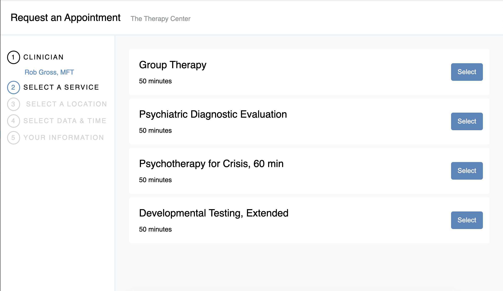
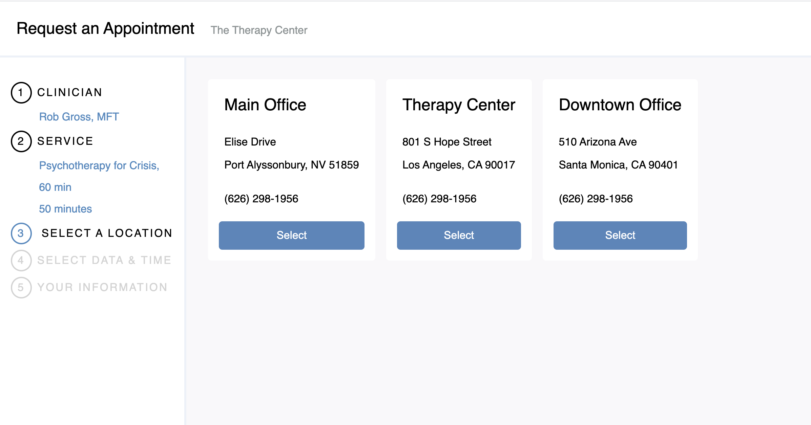
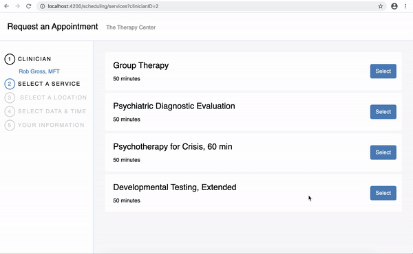

# Introduction
Scheduling Widget
## Screenshots
Services screen

Offices creen

## Video

# warning
Because of **CORS** is not configured on API side
we should run Chrome in `disable-web-security` mode,
to do this run the following command:
* MacOS:
  `open -n -a /Applications/Google\ Chrome.app/Contents/MacOS/Google\ Chrome --args --user-data-dir="/tmp/chrome_dev_test" --disable-web-security --disable-site-isolation-trials`
* Linux:
  `google-chrome --disable-web-security`

# General info

## Prerequisites

You will need the following things properly installed on your computer.

* [Git](https://git-scm.com/)
* [Node.js](https://nodejs.org/) (with npm)
* [Ember CLI](https://ember-cli.com/)
* [Google Chrome](https://google.com/chrome/)

## Installation

* `npm install`
* You should create `.env` file and set variables.
For development you can copy values from `.sample.env`. 

## Running / Development

* `ember s`
* Visit your app at [http://localhost:4200](http://localhost:4200).
* Visit your tests at [http://localhost:4200/tests](http://localhost:4200/tests).

### Running Tests

* `ember test`

### Linting

* `npm run lint`
